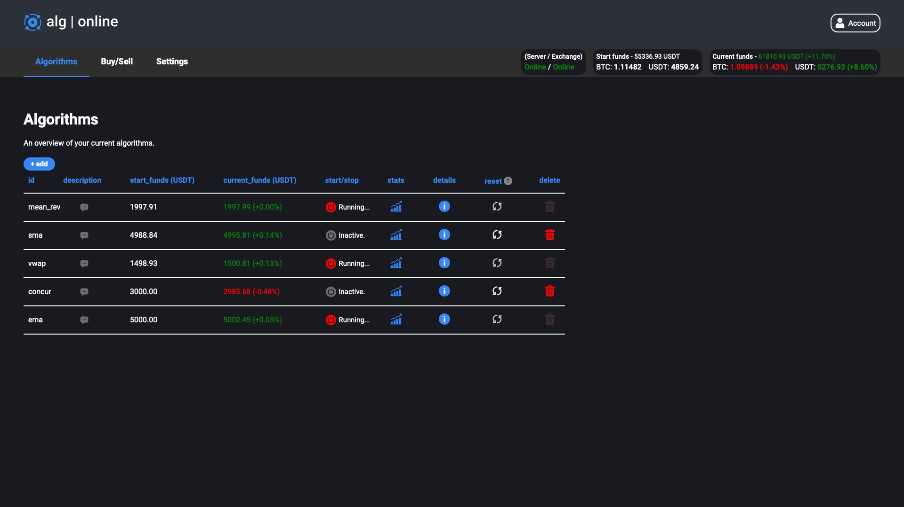
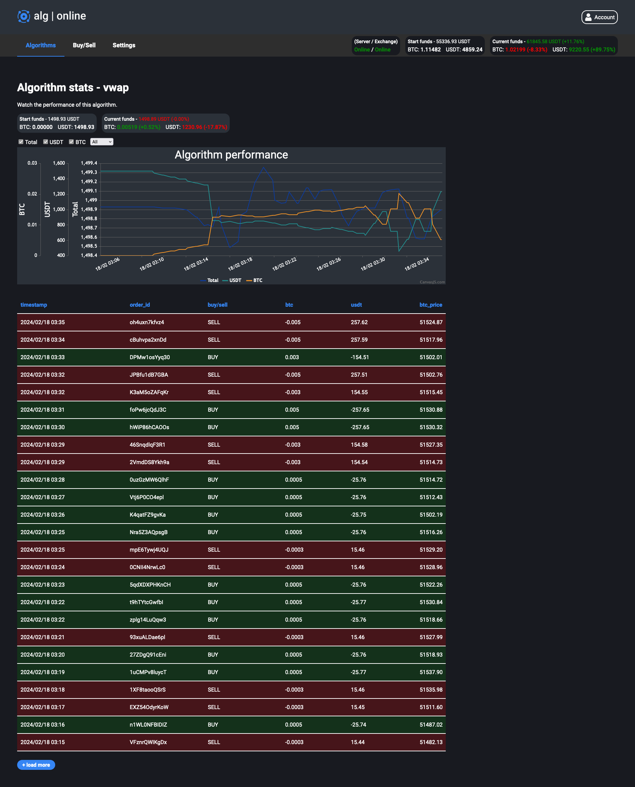
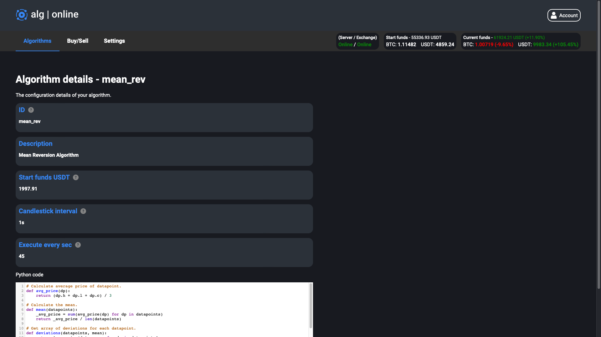
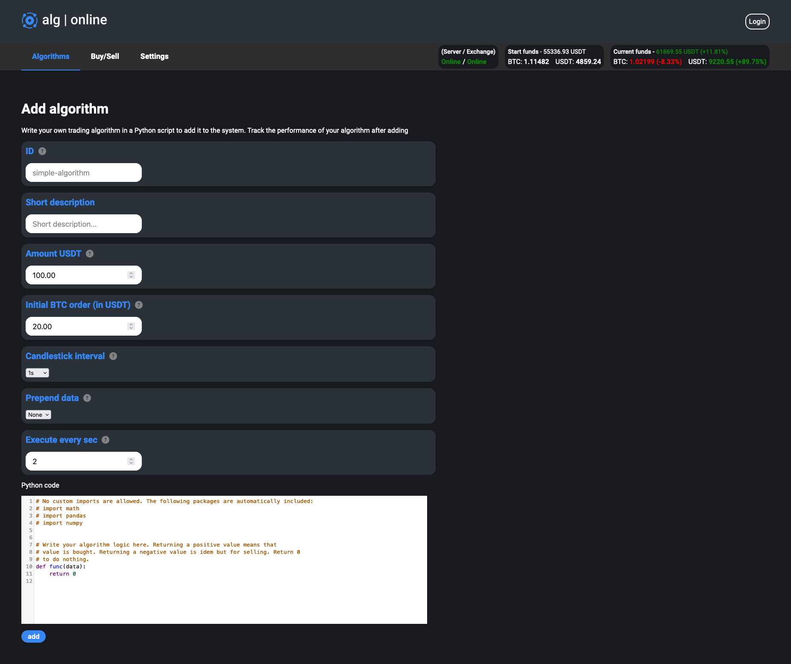
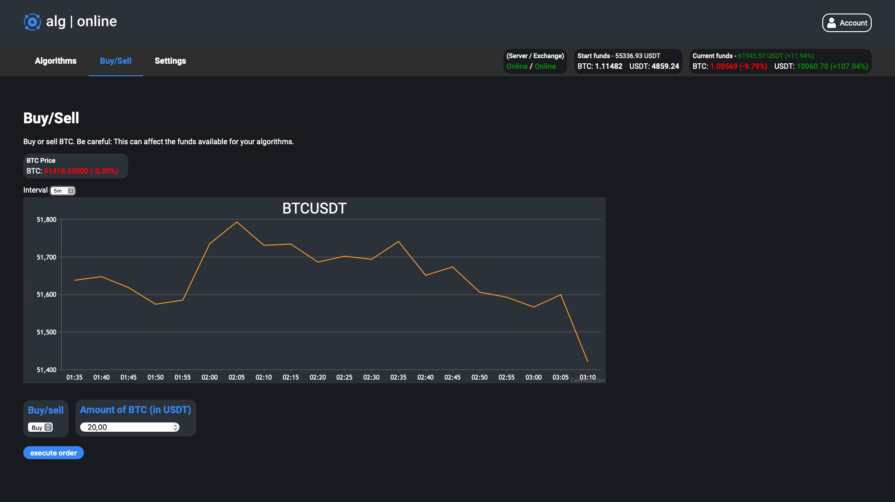
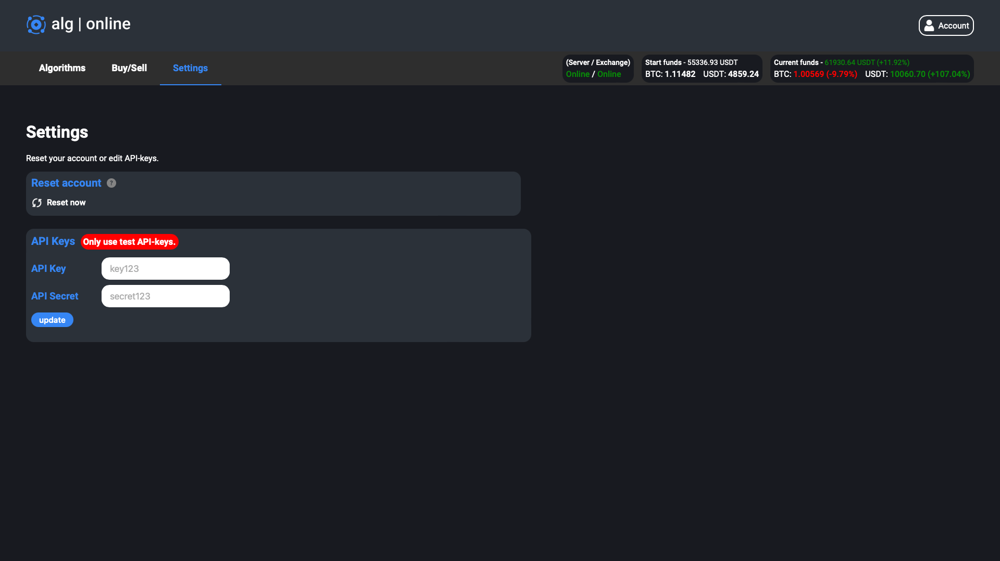

# Algonline - Demo
Algonline is a platform where users can upload their own custom trading algorithms for BTCUSDT written in Python and track the performance of each algorithm. The Python code is interpreted in Rust using PyO3 and the data to feed the algorithm is retrieved from the Binance websocket- and REST-API. This project serves as demo for my job application.

The code base exists mainly out of Rust, a big part is also written in NodeJS. Besides that PostgreSQL and Unix (GNU/Linux) are part of the technology stack.

**Used skills (i.a):**
- Rust.
- NodeJS.
- SQL.
- Python.
- Unix.
- Low-level understanding of HTTP-protocol.
- Streams.
- Websockets.
- Multi-threading.
- Asynchronous programming.
- IPC-communication (shmem + unix sockets).
- Use of APIs (BinanceAPI, signed requests, REST, Websocket,...).
- ...

For each section of the project a folder exists in this repository where I explain the details.

## Screenshots
Algorithm overview

Algorithm statistics

Algorithm details

Add algorithm

Buy/sell BTC manually

Settings

