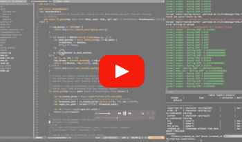

# Algonline - Demo
[Algonline.be](https://algonline.be) is a platform where users can upload their own custom trading algorithms for BTCUSDT written in Python and track the performance of each algorithm. This project serves as demo for my job application.

**Summary - The user interacts with the platform through a web-application written in NodeJS. He can upload trading algorithms written in Python to trade BTC/USDT. We retrieve the market-data from the Binance REST- and websocket-API. Through inter-process communication the retrieved data is fed to a separate process interpreting the Python-script using PyO3 and executing it in Rust. The Python-script returns an order-signal to buy or sell, this order is executed using the Binance websocket-API. The user can track the performance of an algorithm by viewing the funds of this algorithm in a chart live-updated using websockets. This results in a user-friendly platform where different trading algorithms can be tested with low-latency.**

The code-base exists mainly out of Rust, a big part is also written in NodeJS. Besides that PostgreSQL and Unix (GNU/Linux) are part of the technology stack.

**Used skills (i.a):**
- Rust.
- NodeJS.
- SQL.
- Python.
- Unix.
- Low-level understanding of HTTP-protocol.
- Streams.
- Websockets.
- Multi-threading.
- Asynchronous programming.
- IPC-communication (shmem + unix sockets).
- Use of APIs (BinanceAPI, signed requests, REST, Websocket,...).
- ...

For each section of the project a folder exists in this repository where I explain the details.

## Demovideo
I made a video demonstrating the project and explaining the code. The video has a duration of 24 minutes, use the timestamps below to jump to your area of interest.

### Timestamps
**Intro:**
- [(00:00) - Intro.](https://youtu.be/gX2NasubZk8?si=cSmA4dD2ZdHmVXDn)

**Demonstration:**
- [(00:30) - Algorithm overview.](https://youtu.be/gX2NasubZk8?si=sPgkIq14dfWc5jpn&t=30)
- [(01:02) - Configuration details of an algorithm.](https://youtu.be/gX2NasubZk8?si=PsyF0ZAcHfFfR37H&t=62)
- [(01:39) - Executing orders manually.](https://youtu.be/gX2NasubZk8?si=zL8tINC_CazNiuRm&t=99)
- [(02:10) - Adding an algorithm.](https://youtu.be/gX2NasubZk8?si=hAsgF1zOvREho__t&t=130)
- [(03:22) - Statistics of an algorithm.](https://youtu.be/gX2NasubZk8?si=4RfzvLo_yQA7iUCR&t=202)

**Project architecture:**
- [(04:04) - Project architecture.](https://youtu.be/gX2NasubZk8?si=Z3IJngNnrvXkfrP3&t=246)

**NodeJS code:**
- [(05:22) - NodeJS web-application code.](https://youtu.be/gX2NasubZk8?si=QV8mW0S3uZYhO7kW&t=322)

**Rust code:**
- [(06:41) - main.rs file.](https://youtu.be/gX2NasubZk8?si=ahioK1huaUAkqYtC&t=401)
- [(07:22) - Processing HTTP requests.](https://youtu.be/gX2NasubZk8?si=TPbdfeD0a5C9n-k2&t=442)
- [(08:57) - Handling websocket connections.](https://youtu.be/gX2NasubZk8?si=CDtgRJYRqZNw4bMQ&t=537)
- [(10:35) - Interface for the Binance API.](https://youtu.be/gX2NasubZk8?si=ePOCJi2_IKu7kZqS&t=635)
- [(12:57) - Endpoint to start an algorithm.](https://youtu.be/gX2NasubZk8?si=NBMYeQATpJpUX7p7&t=777)
- [(15:53) - Logic for starting an algorithm.](https://youtu.be/gX2NasubZk8?si=J4LYANuuZhUlie0p&t=953)
- [(20:17) - PythonExecutor executing Python scripts in Rust using PyO3.](https://youtu.be/gX2NasubZk8?si=uW-VJaiZvWf6YBLH&t=1217)

**Outro:**
- [(24:20) - The end.](https://youtu.be/gX2NasubZk8?si=q1uViAsoubOBmYzI&t=1460)

## Screenshots
Algorithm overview

Algorithm statistics

Algorithm details

Add algorithm

Buy/sell BTC manually

Settings

