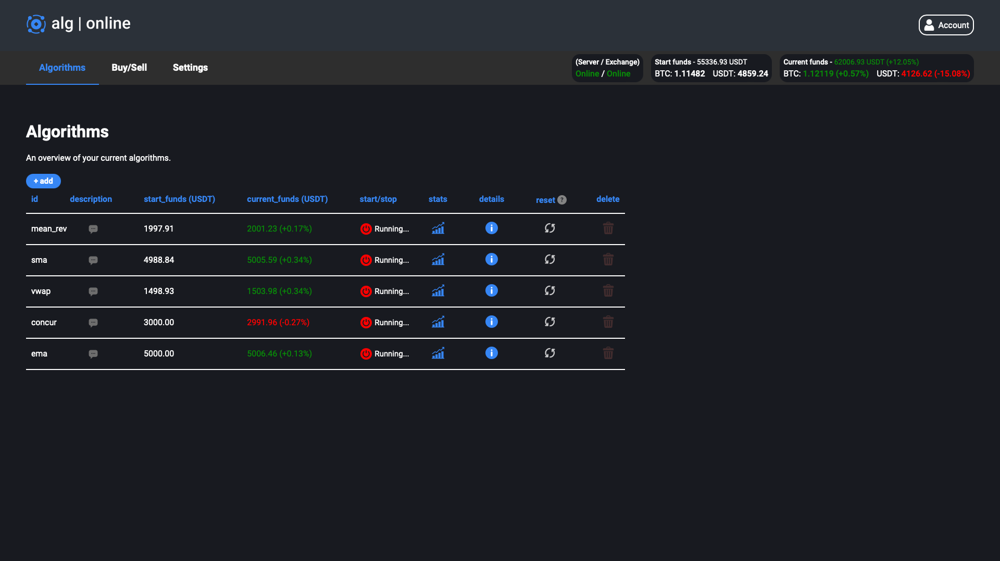

# Trading Algorithms

I honestly do not have any professional experience with trading or finance, yet... ;)

What I do possess however is a huge interest in everything evolving economics, the markets and entrepreneurship. This is reflected by e.g the books I read: I for example study the work of iconic economists like The Wealth of Nations from Adam Smith, love to watch podcasts/video's about the market and have shown some entrepreneurial initiatives.

In addition I also have the idea that I do have a feeling for understanding the underlying principles of markets and economics which will allow me to learn fast in this field.

Currently I am also compiling a small document containing a resume of the educational material I gather from Investopedia.com about trading, the Binance API about crypto trading specifically and the type of orders, and last but not least the articles on Keyrock's blog, in an attempt to widen my knowledge about the basics of this matter.

For now I have already implemented some basic trading algorithms on the platform. These algorithms are currently yielding a positive result but of course that is no indication of their success because of the short time span. I also want to clarify that I am not necessarily applying for the position to develop the math behind new trading algorithms but for the position to support the implementation of these.

## Moving Averages
By using Moving Averages as indicator we aim to disregard sudden short-term fluctuations in the evolution of the asset value by generating a constantly updated average of the price. There are different types of MA's, I have implemented two of them.

### Simple Moving Average

In [sma.py](sma.py) I have implemented a Simple Moving Average indicator. To calculate the SMA we cumulate the total of closing prices in a specified window of our data set and divide it by the number of datapoints in that window.

In this implementation I calculate the SMA for a long-term window and a short-term window. If the SMA for the short-term window is bigger then the value for the long-term window it indicates a bullish market and thus we return an order-signal to buy.

The way we compare two moving averages of two different windows somewhat resembles the **Golden Cross Pattern**.

### Exponential Moving Average
The script [ema.py](ema.py) contains a implementation for EMA. The difference between EMA and SMA is that EMA is a weighted moving average, we put more weight on the more recent datapoints resulting in the indicator being less 'lagging' and being able to make decisions faster.

In this implementation I calculate the EMA for all the datapoints in a specified window except the last one. The last datapoint is compared to the EMA to decide what order-signal to return.

## Mean Reversion Strategy
This strategy assumes that the average of asset prices will return to the long-term mean in their historical data. In [mean_rev.py](mean_rev.py) I have made a implementation for this.

I calculate the variance for the whole specified window in the dataset, next I calculate the deviation of the last datapoint to return a z-score. I compare the z-score to check if it exceeds predefined thresholds of deviation. Depending on if the deviation is negative or positive I return the complimentary order-signal.

It would be interesting to make a implementation to return an amount with order-signal relative to the size of the deviation.

## Volume-Weighted Average Price
VWAP indicates the price of an asset adjusted by it's volume. In the implementation you can find in [vwap.py](vwap.py) you'll see I calculate the average price `(price_high + price_low + price_close) / 3` for each datapoint and divide it by the total volume of those datapoints.

This result is compared against the average price of the last datapoint to return the complimentary order-signal.

## Concurrent Increase / Decrease
The algorithm in [concur.py](concur.py) is pretty intuitive. We basically define a window of the datapoints to consider in the dataset and reverse this list, next we start at the last datapoint (last in time, first in reversed dataset) and check if the price of the asset increases or decreases concurrently. 

We have defined a threshold indicating how many concurrent increases or decreases are required to generate the order-signal. The threshold to sell is half of the threshold to buy, this to escape bearish markets quicky.

## Results

These algorithm seem to yield a positive result. But of course this is not an indication of their success due to the short time span they were active.

