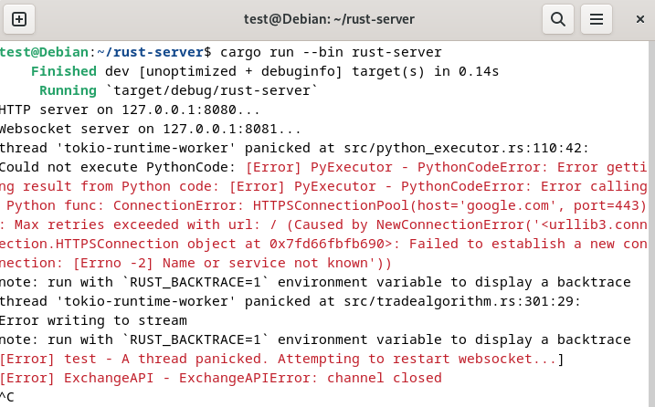

# Unix

Het project is gedeployed op een Linux Debian VPS. Er zijn standaard zaken geconfigureerd zoals Nginx als proxy manager om de NodeJS webserver toegankelijk te maken, en configuratie voor een SSL-certificaat.

Ik ga echter enkel dieper ingaan op de configuratie die gebruikt is voor een bepaald probleem in het project.

**Probleem:** De gebruiker can zelf Python scripts uploaden die trading algoritmes bevatten. Deze code zou enkel in staat moeten zijn om wiskundige operaties uit te voeren en zou nooit
onbedoeld bestanden moeten kunnen lezen of wijzigen en zou ook geen toegang moeten hebben tot het netwerk.

Op code-level is dit deels opgelost door te controleren of de code keywords bevatten die geblacklist zijn, zoals 'import', 'os', 'request',... Echter willen we uiteraard ook op OS-level wat beveiliging implementeren.

Oplossing: We gebruiken cgroups en AppArmor voor de PyExecutor.

## AppArmor
In AppArmor maken we in `/etc/apparmor.d` een profiel aan om een verbod op te leggen op alle netwerken en een verbod op toegang tot alle bestanden behalve die toegestaan zijn.
```
#include <tunables/global>

/home/test/rust-server/target/debug/python-executor {
	# deny all outgoing network requests.
	deny network inet,
	deny network inet6,
	deny network tcp,
	deny network udp,
	
}
```

Vervolgens enforcen we dit profiel `sudo aa-enforce python_executor`. Wanneer dan het volgend script uitgevoerd zou worden door PyExecutor
```
import requests

def func(data):
    req = requests.get("https://google.com")
    print(req)
    return 0
```

Krijgen we de volgende foutmelding:



## Cgroups
De gebruiker zou ook een script kunnen uploaden dat veel van de system resources van de VPS zou verbruiken (CPU en memory) in de hoop zo de server neer te halen d.m.v aan DoS-attack.
In Linux kunnen we control groups definieren die verschillende processen in een cgroup plaatst met regels omtrent het maximaal aantal resources dat dit process mag gebruiken.

Eerst creeeren we een cgroup:
```
sudo cgcreate -g cpu,memory:pyexecutor
sudo cgset -r memory.max=400000 pyexecutor
sudo cgset -r cpu.max=75000 pyexecutor
```

We hebben een cgroup gecreerd die een max bandwith limit van 75000 heeft voor de CPU, en max 0.4mb voor geheugen.

Vervolgens creeer ik volgend bestend `/etc/cgrules.conf`:
```
*:python-executor cpu,memory pyexecutor
```

Met het volgend commando `watch -n 5 'sudo cgclassify $(pgrep -x python-executor | tr "\n" " ")'` worden alle PID's van de Rust-binary python-executor om de 5 seconden automatisch aan de juiste cgroup toegevoegd.

Als we dan even het memory-gebruik van de python-executor processen opvolgen met het `top`-commando zien we inderdaad dat deze processen worden afgesloten zodra ze de limiet bereikt hebben.


