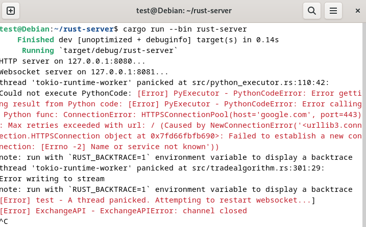
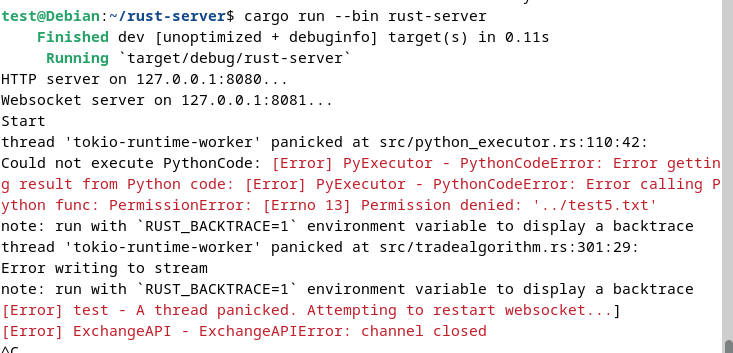
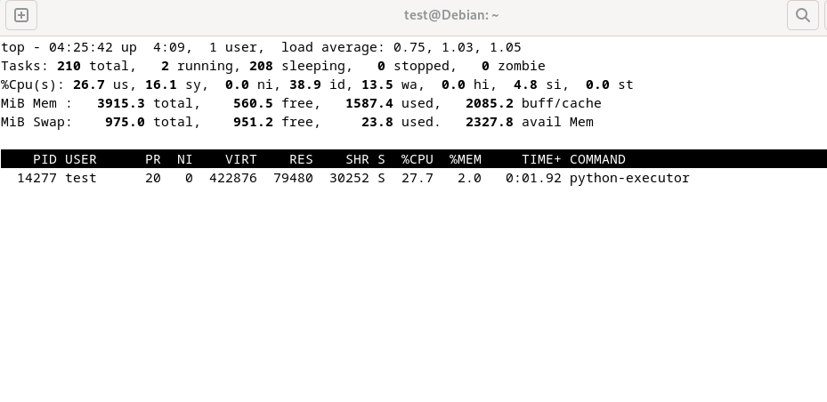

# Unix

This project is deployed on a Debian GNU/Linux VPS. I will not explain the basic configuration of Nginx as reverse proxy or managing the SSL-certificate.

I will explain the configuration I have used to solve a potential security threat.

**Security threat:** The user is able to upload custom Python scripts which will be executed on our server. This contains the risk that an user with mal intent uploads a vicious script trying to read/modify files on our server or upload a script using an unnormal amount of system resources trying to take down the server with a DoS-attack.

On code-level we partly migitated this risk by filtering the uploaded code on blacklisted keyworks like "import", "eval", "os", "file",... The code should only be able to do calculations on the provided data and should not have access to the network or unpermitted files on the server. Besides blacklisting on code-level we of course also want to implement security protocol on OS-level.

**Solution:** We use cgroups and AppArmor for the PyExecutor. Note that all the Python code is executed in a separate binary/process then our Rust-server. 

## AppArmor
For AppArmor we make a profile in `/etc/apparmor.d` to restrict access to the network and all files except those who are required.
```
#include <tunables/global>

/home/test/rust-server/target/debug/python-executor {
	# deny all outgoing network requests.
	deny network inet,
	deny network inet6,
	deny network tcp,
	deny network udp,

	# Denying access to files.
	deny /home/test/* rwkx,
	deny /home/test/rust-server/* rwkx,

	# Allowing specific files.
	allow /home/test/rust-server/tmp/shmem/* rwk,
	allow /home/test/rust-server/tmp/sockets/* rwk,
	allow /home/test/rust-server/trading_algos/* rwk,
	allow /home/test/rust-server/trading_algos/test/* rwk,
}

```

Next we enforce this profile: `sudo aa-enforce python_executor`. When e.g the following Python-script is uploaded with an attempt to execute it,
```
import requests

def func(data):
    req = requests.get("https://google.com")
    print(req)
    return 0
```

we get the following error:



Trying to add a file with `f = open("../test.txt", "w")` in the Python-code yields the following error:




## Cgroups
The user with malicious intents could also try to make a script which on purpose uses a lot of the system resources on our VPS in an attempt to take the server down with a DoS-attack. We can migitate this risk by using control groups.
We can place the PID's of all the processes initiated by PyExecutor in a control group which enforces limits on the maximum amount of system resources these processes can use.

To start we create a cgroup:
```
sudo cgcreate -g cpu,memory:pyexecutor
sudo cgset -r memory.max=400000 pyexecutor
sudo cgset -r cpu.max=75000 pyexecutor
```

We have created a cgroup with a max bandwith limit of 75000 for the CPU and a max if 0.4mb for memory.

Next we create the following config-file `/etc/cgrules.conf`:
```
*:python-executor cpu,memory pyexecutor
```

With this command `watch -n 5 'sudo cgclassify $(pgrep -x python-executor | tr "\n" " ")'` all the PID's of the Rust-binary PyExecutor are automatically placed in the correct cgroup every 5 seconds.

When monitoring the memory usage of all the processes of PyExecutor using the `top`-command we can see that the process is indeed killed when it exceeds the configured limit.


